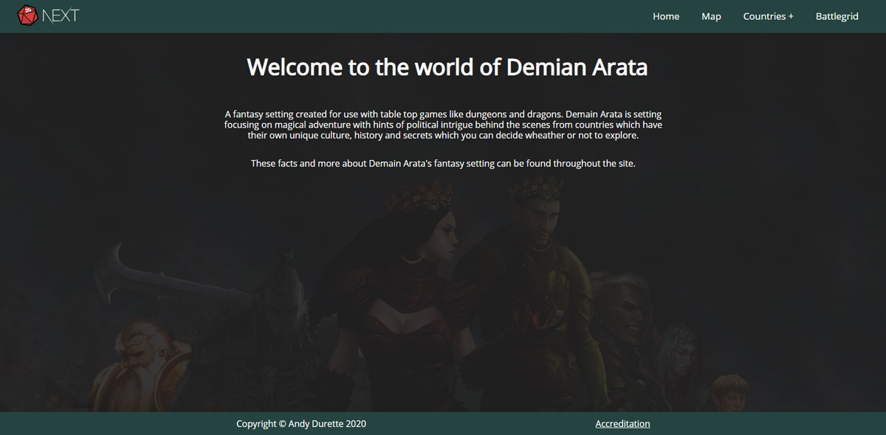
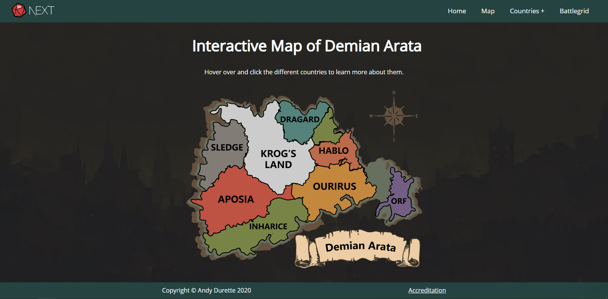
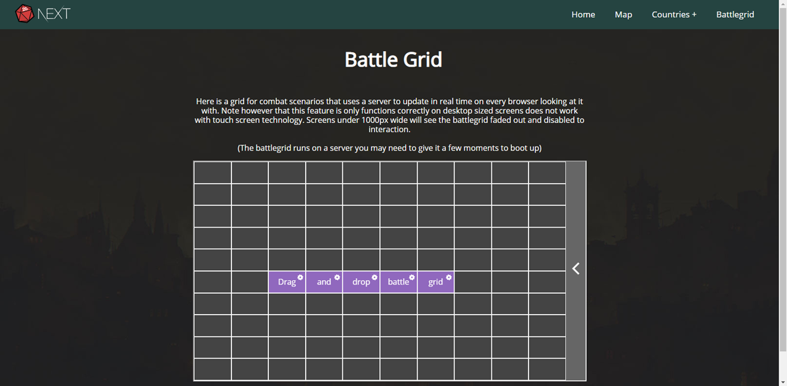

# Next Fantasy

### Overview

In an attempt to learn NEXT.JS I decided for fun to build a Tabletop fantasy setting to also strengthen my skills with devops and testing I built the site integrating.

* Next.js dynamic routing.
* A Travis CI/CD pipeline.
* Tests and Linting rules which would stop Travis from passing. 

Live: https://nextfantasy.herokuapp.com/

### Features

An interactive svg map.

And a fully working battle grid setup with a firebase database and websockets for live updates to the grid across browsers.

Git repo for that at: https://github.com/andydurette/websocket-draganddrop

